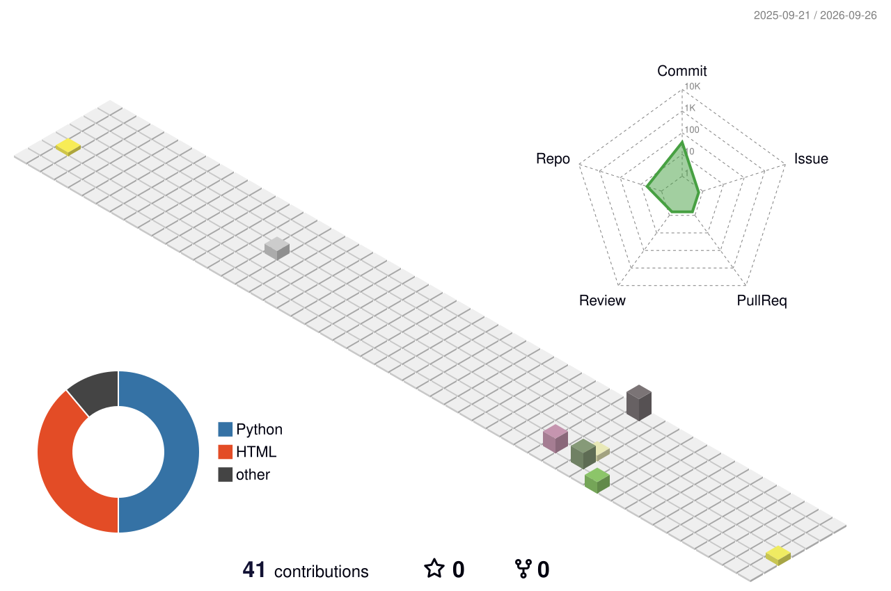

  

  

---

## 💫 About Me

<table>
<tr>
<td width="58%" valign="top">

🔭 I'm currently working on **Python & Web-based applications**

🤝 I'm looking to collaborate on **open-source, backend, and full-stack projects**

🧠 I'm looking for help with **system design, scalability, and clean architecture**

🌱 I'm currently learning **advanced Python, APIs, databases, and cloud basics**

💬 Ask me about **Python, Flask, PHP, web development, and backend logic**

⚡ Fun fact: I enjoy turning real-world problems into simple, working solutions

</td>
<td width="42%" valign="top">

</td>
</tr>
</table>

  
<b>🎯 My Current Goals</b> — click to expand 👀

  - [ ] Master advanced Python & clean backend architecture
  - [ ] Ship 3 production-level APIs
  - [ ] Learn cloud deployment (CI/CD, AWS basics)
  - [ ] Contribute to open source 🌍

---

## 🌐 Connect With Me

---

## 🛠️ Tech Stack

  

  

---

## 📊 GitHub Stats

---

## 📈 Contribution Activity

---

## 🧊 My Contributions in 3D

---

## 🐍 Snake Eating My Contributions

<picture>
  <source media="(prefers-color-scheme: dark)" srcset="https://raw.githubusercontent.com/omshukla-tech/omshukla-tech/output/github-snake-dark.svg"/>
  <source media="(prefers-color-scheme: light)" srcset="https://raw.githubusercontent.com/omshukla-tech/omshukla-tech/output/github-snake.svg"/>
  
</picture>

---

## 🏆 GitHub Trophies

---

## 🔝 Top Contributed Repos

---

## ✍️ Dev Quote of the Day

---

  

